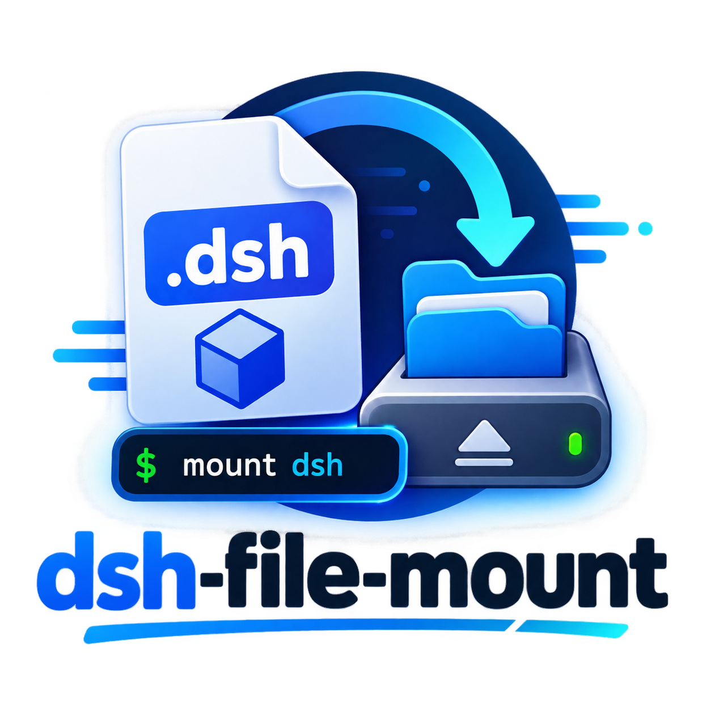

# dsh-file-mount

<p align="center">
  
</p>

A DeepSeek Harness plugin: **incremental file mounting with read dedupe**. It records which line ranges of each file are already in the model context, re-reads only add the missing parts, on-disk changes re-send only the changed lines (line-level diff), and a Mounted Files dashboard shows the live ledger.

Ported from [piwpi](https://github.com/earendil-works/pi-mono)'s context-mount mechanism.

## What it does

- **Model side**: already-mounted ranges are never re-sent (dedup marker); missing or changed lines ride the durable tool result (increment / remount), and the plugin notice is a ledger declaration only; file edits re-send only the changed lines (append-only logs only re-send the new tail); files the AI just wrote are mounted as already known and read for free; a `file_mount_forget` tool lets the model force a fresh re-read.
- **UI side**: the Mounted Files tab is a dashboard; opening it stays at the **top**, with **net savings and path search pinned** while the file list scrolls; each file row expands into its **segments**, each with a **freshness bar** (green=fresh / yellow=aging / orange=stale / red=expired / grey=unknown) and an **expired-count**; plus a **coverage map** (filled spans show which lines are already in context), search, sorting, and the net-savings/CNY header; remounted rows carry a "remounted" mark.
- **Savings accounting**: CJK characters count as 1 token each, other characters as chars ÷ 4; both saved tokens and the plugin's own note overhead are tracked, and the UI shows the NET figure (floored at 0); optional cross-session totals persist to a `statsFile`.

## Install

One package, two halves: `dsh.bundle.patch` mounts the host plugin row; the `dsh.client` manifest lets the web scanner pick up the browser half. After install, **restart the harness** (a page refresh is not enough). You need **pnpm** on PATH (`dsh plugin` forwards to it) and Node `^22.19 || >=24`.

### 1. GitHub Release (recommended)

```sh
npx --yes @deepseek-ai/dsh plugin --profile web add https://github.com/acefun29/dsh-file-mount/releases/latest/download/dsh-file-mount.tgz
npx --yes @deepseek-ai/dsh --profile web
```

If `dsh` is on PATH, the first line is `dsh plugin --profile web add https://github.com/acefun29/dsh-file-mount/releases/latest/download/dsh-file-mount.tgz`. This is a prebuilt tarball: no npm, no `allowBuilds`.

If `npx @deepseek-ai/dsh` prints nothing for a long time, it is fetching the CLI — wait it out, or use a dsh that already booted once (`~/.dsh/profiles/node_modules/@deepseek-ai/dsh`).

### 2. From this checkout

```sh
pnpm dsh:install
```

The installer packs a tarball and adds `file:E:/...tgz`. Do not `dsh plugin add .` or `file:E:\...` on Windows — pnpm joins the drive letter onto the profile directory, so the plugin installs but never activates.

### 3. Local tarball

```sh
pnpm run build
npm pack --ignore-scripts
dsh plugin --profile web add file:$(pwd)/dsh-file-mount-$(node -p "require('./package.json').version").tgz
```

Windows PowerShell:

```powershell
pnpm run build
npm pack --ignore-scripts
$Tgz = ((Get-Location).Path -replace '\\','/') + "/dsh-file-mount-$((Get-Content package.json -Raw | ConvertFrom-Json).version).tgz"
npx --yes @deepseek-ai/dsh plugin --profile web add "file:$Tgz"
```

Do not install with `github:acefun29/dsh-file-mount`: the git tree has no `lib/`, and this package has no `prepare` script. Use the Release tarball or the installer above.

Then start with `npx @deepseek-ai/dsh --profile web`.

## Config

```yaml
- id: file-mount
  name: dsh-file-mount
  config:
    enabled: true            # master switch; off keeps every read native
    capacity: 32             # file identity cache capacity (mounted files are pinned)
    ttlMs: 300000            # safety valve: force re-read after this interval
    maxPinnedFiles: 256      # max mounted files pinned per session
    minSavedTokens: 16       # dedup/increment below this net saving passes through natively without writing the ledger (and does not count toward the safety valve)
    maxFingerprintBytes: 1000000   # files above this keep no line draft (whole remount)
    maxManagedBytes: 16777216      # files above this are not managed at all
    excludeGlobs: ['**/node_modules/**']  # these paths always pass through
    statsFile: ./dsh-file-mount-stats.json  # optional cross-session totals file
    freshnessEnabled: true        # freshness: on by default
    pinAfter: 1                   # pin after one expiry — a segment is re-sent at most once
    contextWindow: 128000         # default W when the session has not reported a window
    # resendBudget: 8000          # optional: skip expiring a segment larger than this
    valveReads: 2                 # re-read safety valve: consecutive full intercepts before native pass-through (0 = disabled)

## How it works

The plugin sits on the `tools/post-execute` interception point, dispatched by tool name:

1. **read**: derives the window from the canonical value; a stat-verified cache (mtime+size fast path + sha256) confirms identity; then: full coverage replaces the result with a dedup marker (only the FIRST dedup note per file between real messages — repeats are silent and their savings merge into the next message); partial coverage and hash-change remounts put the missing/changed **body on the durable tool result** (each line prefixed with `N: ` like native read; so `cancel` clearing the inbox can drop only the ledger notice — next read treats it as unmounted) and a head-only ledger notice on `additionalContexts`; a hash change diffs the stored line draft and re-sends only the changed lines (unchanged lines just shift; unique-line anchors split an oversized LCS middle), falling back to a whole-window remount without a draft or for huge diffs. The first `new` mount still keeps the native read body plus a head-only notice.
2. **write**: the whole file is mounted as already known (free re-reads); the cache identity is invalidated.
3. **edit**: marks the cache identity stale but keeps the line-fingerprint draft; the next read re-reads disk and remounts only the changed lines.
4. Mount state travels as structured fields on injected message sources (standard `user/message` events), shared by resume replay and the browser fold through ONE merge rule (`mount-source.ts`).
5. Compaction awareness: canonical checkpoints (source `{ kind: 'plugin', plugin: 'compact' }` with `sourceEventSeqs`) shadow stale mounts, which are skipped.
6. The model can call `file_mount_forget` to invalidate a file's ledger entry (forced re-read). The dedup marker tells it to forget then re-read when the mounted content is not in the conversation.
7. **Freshness**: each mounted segment records its carrier message `seq`; the plugin uses that position in the live context to decide whether a range is still worth deduping. Near the window cap, deeper content may leave the ledger and be re-sent on the next read; after one expiry the segment is pinned. Compaction is what actually removes content from the context. A re-read safety valve still applies. Freshness is not adjustable from the dashboard.
Path identity: ledger keys are absolute path + `realpath` (symlinks unify to the real file) + case folding (probed per filesystem; Windows and default macOS fold). Marker heads shown to the model use a path relative to the workspace cwd (forward slashes); cwd comes from the session `header.cwd`, else `dsh-fs-local`'s `cwd`.

## Known limitations

- Compaction voids the mounted guarantee: shadowed mounts are skipped and re-anchor on the next read.
- Increment/dedup/remount replace the result text, so the UI read card degrades to the generic card (the canonical value stays intact).
- Depends on the read/write/edit canonical value shapes; a shape change trips the guard and passes through natively (pinned by integration tests).
- Files over `maxManagedBytes` and `excludeGlobs` matches are not managed (no sampling — a sampled fingerprint risks missing a change and falsely deduping).
- Custom session event types cannot persist safely on rc.6, so the ledger rides structured source fields on standard events.
- Freshness is heuristic: expiry does not mean the content left the context (only compaction does) — it means attention decayed past usefulness, so re-sending is a deliberate token cost. Sessions without usage data show grey "unknown" and never expire.
- The browser conversation is a paginated history window (tail page of 50 messages by default; earlier pages load on scroll-up); the dashboard fold accumulates across snapshot revisions, so files whose mount messages scroll out of the window stay listed. Compaction-shadowed mounts are dropped host-side, but the browser has no shadow list — the row persists until the file is next re-mounted.
- Dashboard "jump to conversation", the cross-session totals UI, and live "file changed" hints are deferred (no browser-side channel).

## FAQ

- **Why does the read card degrade to a generic card?** The plugin replaces the model-visible result text (dedup marker / increment or remount body) at post-execute; the canonical value stays intact, but the card renders from the result text.
- **How do I keep the plugin away from some files?** `excludeGlobs` for paths (e.g. `**/node_modules/**`), `maxManagedBytes` for the size cap; excluded/huge files pass through untouched.
- **How accurate are the numbers?** Estimates: CJK char ≈ 1 token, others 4 chars ≈ 1 token; the UI shows net (saved − note overhead, floored at 0) and a rough CNY figure (¥1 per million tokens).
- **Can the model force a re-read?** Call `file_mount_forget` to invalidate a file's ledger entry. The dedup marker also says: if the content is not in the conversation above, forget then read again.
- **Where are cross-session totals?** Configure `statsFile`; totals accumulate there and are readable via `fileMount.stats()`. The UI display is deferred.
- **`npx @deepseek-ai/dsh plugin add …` prints nothing?** npx is fetching the full CLI and can sit for minutes. Install from the GitHub Release `dsh-file-mount.tgz` URL; from this repo use `pnpm dsh:install`. On Windows do not `add .` — use `file:E:/...tgz` (forward slashes).
- **Installed but no Mounted Files tab?** A Windows directory install junctions to the wrong path, so the package never joins `dsh.profile.bundles`. Reinstall from the Release tarball or `pnpm dsh:install` and restart the harness.

## Development

```sh
pnpm install
pnpm test        # vitest: unit + real read/write loop integration + persistence + compaction + freshness + client components
pnpm typecheck   # tsc --noEmit
pnpm run build   # tsc + tsdown (lib/index.js / lib/client.js)
pnpm dsh:install # pack a tarball and install into the local web profile (works on Windows)
```

To cut a GitHub Release: push a `v*` tag; CI uploads the stable asset `dsh-file-mount.tgz` (`releases/latest/download/dsh-file-mount.tgz`). npm publish is deferred.

**Run the tests after every DSH upgrade**: coupling points like the compaction checkpoint shape are pinned by tests (`tests/compaction.spec.ts`), so a DSH shape change fails loudly.

Peers on DSH 0.1.0-rc.5 and later (`@deepseek-ai/dsh-*`, `@deepseek-ai/cordis` ^4, React 18).

## License

MIT