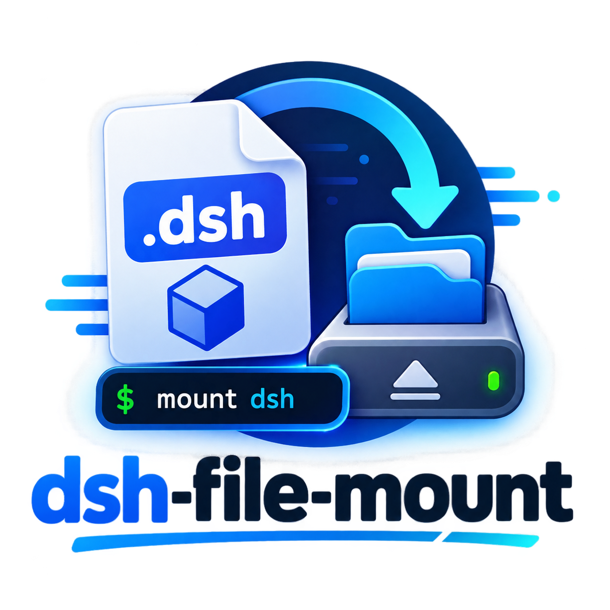
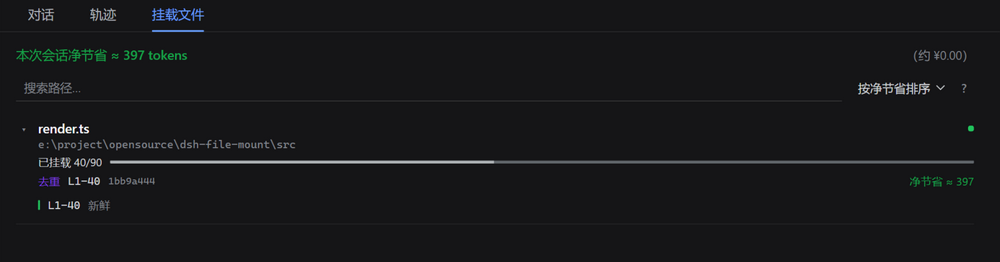

# dsh-file-mount

<p align="center">
  
</p>

<p align="center">
  <a href="LICENSE"></a>
  
  =24">
</p>

A DeepSeek Harness plugin: **incremental file mounting with read dedupe**. It records which line ranges of each file already entered the model context, so re-reads only add what is missing, on-disk changes re-send only the changed lines (line-level diff), and a Mounted Files dashboard shows the live ledger.

Ported from [piwpi](https://github.com/earendil-works/pi-mono)'s context-mount mechanism.

## Why

Agents re-read the same files constantly: glance at an implementation, change two lines, read it again; or read the same file through a different window. Every pass costs full tokens even though the model **just saw** most of that text.

This plugin keeps a ledger of what has been read. From the second read onward, only genuinely missing or changed lines enter the context — the rest collapses into a one-line dedupe notice. You save context, and you save money.

## What you get



- **Model side**: already-mounted ranges are never re-sent (dedupe marker); missing or changed lines ride the durable tool result (increment / remount) while the notice is a ledger declaration only; edits re-send only the changed lines (append-only logs only re-send the new tail — append detection also covers large files above the fingerprint cap); files the AI just wrote are mounted as already known and read for free (unless the on-disk content no longer matches what the model wrote, e.g. a format-on-save hook rewrote it); a `file_mount_forget` tool lets the model force a fresh re-read.
- **UI side**: the Mounted Files tab is a dashboard; opening it stays at the **top**, with **net savings and path search pinned** while the file list scrolls. Each file row expands into its **segments**, each with a **freshness bar** (green = fresh / yellow = aging / orange = near expiry / red = expired / grey = unknown) and an **expiry count**; plus a **coverage map** (filled spans show where the mounted lines sit in the file), search, sorting, and the net-savings / CNY figures. Context injection rows in the conversation carry a marker when the file changed.
- **Savings accounting**: CJK characters count as 1 token each, other characters as chars ÷ 4. Both the saved tokens and the plugin's own overhead (notices, markers, expiry re-sends) are tracked, and the UI shows the **net** figure (floored at 0); optional cross-session totals persist to a `statsFile`.

## Install

One package, two halves: `dsh.bundle.patch` mounts the host plugin row, and the `dsh.client` manifest lets the web scanner pick up the browser half. After installing, **restart the harness** (a page refresh is not enough). You need **pnpm** on PATH (`dsh plugin` forwards to it) and Node `^22.19 || >=24`.

### Quick start (recommended)

```sh
npx --yes @deepseek-ai/dsh plugin --profile web add https://github.com/acefun29/dsh-file-mount/releases/latest/download/dsh-file-mount.tgz
npx --yes @deepseek-ai/dsh --profile web
```

With a global `dsh`, replace the first line with `dsh plugin --profile web add <the same URL>`. This is a prebuilt tarball: no npm, no `allowBuilds`.

If `npx @deepseek-ai/dsh` prints nothing for a long time, it is fetching the CLI (the first run downloads the whole dependency tree) — just wait it out.

### From this checkout

```sh
pnpm dsh:install
```

The installer builds, packs a tarball, and adds it as `file:E:/...tgz`.

> **Windows note**: never `dsh plugin add .` or `file:E:\...` (backslashes) for a directory. pnpm joins the drive letter onto the profile directory (`profile\E:\...`), so the plugin installs but never activates. The installer already handles this.

### Manual local tarball

```sh
pnpm run build
npm pack --ignore-scripts
dsh plugin --profile web add file:$(pwd)/dsh-file-mount-$(node -p "require('./package.json').version").tgz
```

Windows PowerShell:

```powershell
pnpm run build
npm pack --ignore-scripts
$Tgz = ((Get-Location).Path -replace '\\','/') + "/dsh-file-mount-$((Get-Content package.json -Raw | ConvertFrom-Json).version).tgz"
npx --yes @deepseek-ai/dsh plugin --profile web add "file:$Tgz"
```

Do not install from git (`github:acefun29/dsh-file-mount`): the tree ships no `lib/`, and the package has no `prepare` script. Use the Release tarball or the installer above.

## Config

Put a `config` block on the plugin row in your profile:

```yaml
- id: file-mount
  name: dsh-file-mount
  config:
    excludeGlobs: ['**/node_modules/**']
    statsFile: ./dsh-file-mount-stats.json
```

Every key, with its default:

| Key | Default | Meaning |
| --- | --- | --- |
| `enabled` | `true` | Master switch; off keeps every read native |
| `capacity` | `32` | File identity cache capacity (mounted files are pinned and exempt) |
| `ttlMs` | `300000` | Cache safety valve: forced re-read interval when a stat looks unchanged |
| `maxPinnedFiles` | `256` | Max mounted files pinned per session |
| `minSavedTokens` | `16` | Dedup/increment below this net saving passes through natively without writing the ledger (and does not count toward the safety valve) |
| `maxFingerprintBytes` | `1000000` | Files above this keep no line draft (a pure append is still detected and re-sends only the new tail; otherwise whole-window remount) |
| `maxManagedBytes` | `16777216` | Files above this are not managed at all |
| `excludeGlobs` | `[]` | Matching paths always pass through |
| `statsFile` | none | Optional cross-session totals file |
| `freshnessEnabled` | `true` | Freshness tracking master switch |
| `freshnessThreshold` | `0.6` | Freshness score below which a segment counts as expired |
| `safeRatio` | `0.95` | Pressure-free window ratio (`Lsafe = safeRatio × W`) |
| `safeTokens` | none | Absolute `Lsafe`; takes precedence over `safeRatio` |
| `pinAfter` | `1` | Expiries after which a segment is pinned (pinned segments are never pruned) |
| `contextWindow` | `128000` | Default window `W` when the session reports none |
| `resendBudget` | none | Segments larger than this many tokens are not expired |
| `valveReads` | `2` | Re-read safety valve: consecutive full intercepts before a native pass-through (`0` = disabled) |

## How it works

The plugin sits on the `tools/post-execute` interception point, dispatched by tool name:

1. **read**: derives the window from the canonical value (path/offset/lines/totalLines); a stat-verified cache (mtime+size fast path + sha256) confirms the on-disk identity; then it takes one of three branches. Full coverage replaces the result with a dedupe marker (only the FIRST dedupe notice per file between two real messages — repeats are silent and their savings merge into the next message). Partial coverage or a hash change puts the missing/changed **lines into the durable tool result** (each line prefixed with `N: ` like native read, so `cancel` clearing the inbox can at worst drop the ledger notice — the next read treats the file as unmounted), leaving a head-only ledger notice on `additionalContexts`; on a hash change the stored line draft is diffed and only the changed lines are re-sent (unchanged lines just shift; a unique-line anchor splits an oversized LCS middle); capped files without a draft first try append detection (a prefix hash match keeps old coordinates and re-sends only the new tail, plus the old last line when the append extended it), and only otherwise fall back to a whole-window remount. The first mount still keeps the native read body plus a head-only notice. The line draft mirrors the read tool's splitting exactly (including UTF-8 BOM stripping and CRLF folding); fingerprints are 53-bit fast hashes kept in memory only (never persisted, never sent).
2. **write**: the whole file is mounted as already known (free re-reads); the cached identity is invalidated. When the write canonical value carries the written content (`after`), it is fingerprinted and compared line-by-line with disk first: on a mismatch (e.g. a format-on-save hook rewrote the file) the file is NOT mounted and the next read anchors fresh — content the model never saw is never hidden.
3. **edit**: marks the cached identity stale but keeps the line-fingerprint draft; the next read re-reads disk and remounts only the changed lines.
4. Mount state travels as structured fields on injected message sources (standard `user/message` events), shared by resume replay and the browser fold through ONE merge rule (`mount-source.ts`).
5. Compaction awareness: DSH's canonical checkpoints (source `{ kind: 'plugin', plugin: 'compact' }` with `sourceEventSeqs`) shadow stale mounts, which are then skipped.
6. The model can call `file_mount_forget` to invalidate one file's ledger entry (forced re-read). The dedupe marker tells it to forget-then-read when the mounted content is not in the conversation above.
7. **Freshness**: each mounted segment records the `seq` of the message carrying it, and that position in the live context decides whether the range is still worth deduping. Near the window cap, deeper content may leave the ledger and be re-sent on the next read; after one expiry the segment is pinned. Only compaction actually removes content from the context. A re-read safety valve still applies. Freshness is not adjustable from the dashboard.

**Path identity**: ledger keys are absolute path + `realpath` (symlinks unify to the real file) + case folding (probed per filesystem; Windows and default macOS fold). Marker heads shown to the model use a path relative to the workspace cwd (forward slashes); the cwd comes from the session `header.cwd`, else `dsh-fs-local`'s `cwd`.

## Compatibility

| Plugin | DSH |
| --- | --- |
| `main` (unreleased) | `0.1.5-rc.1` or later, including the session format v4 of `0.1.7` (verified on `0.1.7-rc.2`) |
| `0.5.1`–`0.6.0` | `0.1.5-rc.1` or later (verified on `0.1.5-rc.2`) |
| `≤0.5.0` | DSH from the `0.1.0-rc.5` line; no longer valid once `Session.events` was removed (0.1.2-alpha.4) |

The plugin connects to contracts on both sides: the host's `tools/post-execute` interception point and the read/write/edit canonical values, plus the browser's slots (`conversation.view`) and session snapshot layout.

**Run the tests after every DSH upgrade.** Coupling points — the compaction checkpoint shape, the tool-result shape, the client snapshot layout — are pinned by tests (`pnpm test`), so a shape change fails loudly. Semantic changes that keep the same names (the kind that left a blank dashboard until it was actually exercised in a browser) are only caught by running it for real.

## Known limitations

- Compaction invalidates the "already mounted" guarantee: the mounted content leaves the model context, and the plugin identifies it through the checkpoint's `sourceEventSeqs` and skips it, re-anchoring on the next read.
- Increment / dedupe / remount replace the result text, so the UI read card degrades to the generic card (the canonical value stays intact).
- Depends on the read / write / edit canonical value shapes; a shape change trips the guard and passes through natively (pinned by integration tests).
- Files over `maxManagedBytes` and `excludeGlobs` matches are not managed (no sampling — a sampled fingerprint risks missing a change and falsely deduping).
- Freshness is heuristic: expiry does not mean the content left the context (only compaction does) — it means attention decayed past usefulness, so re-sending is a deliberate token cost. Sessions without usage data show grey "unknown" and never expire.
- The browser conversation is a paginated history window (tail page of 50 messages by default; earlier pages load on scroll-up). The dashboard fold accumulates across snapshot revisions, so files whose mount messages scroll out of the window stay listed. Compaction-shadowed mounts are dropped host-side, but the browser has no shadow list — the row persists until the file is next re-mounted.

### Deferred / next steps

- Dashboard "jump to conversation", the cross-session totals UI, and live "file changed" hints were deferred because the browser side had no channel for them. Since DSH 0.1.5 plugins can register global panels through `sidebar.panellist` / `main`, a cross-session view may be within reach.
- Custom session event types could not persist safely on rc.6 — the historical reason the ledger rides structured source fields on standard events. That carrier still passes the persistence round-trip and resume-replay tests on Session V3.

## FAQ

- **Why does the read card in the UI become a generic card?** The plugin replaces the model-visible result text at post-execute (dedupe marker / increment or remount body). The canonical value is preserved, but the card renders from the result text, so it degrades to the generic card.
- **How do I keep the plugin away from some files?** Use `excludeGlobs` for a denylist (e.g. `**/node_modules/**`) and `maxManagedBytes` for a size ceiling; anything outside the list or over the ceiling passes through natively.
- **Are the savings numbers accurate?** They are estimates: CJK 1 char ≈ 1 token, everything else 4 chars ≈ 1 token. The UI shows the net figure (saved − plugin overhead, where overhead covers notices, dedup/remount markers and expiry re-sends; floored at 0) and a rough CNY conversion at ≈ ¥1 per million tokens.
- **How does the model force a re-read?** It calls `file_mount_forget` to invalidate that file's ledger entry, so the next read re-sends the whole file. The dedupe result says the same thing: forget first, then read, when the content is not in the conversation above.
- **Where do cross-session totals live?** Configure `statsFile` and totals accumulate there; read them through `fileMount.stats()` (the UI for this is deferred).
- **Installed, but there is no Mounted Files tab?** A directory install on Windows links to the wrong path and the plugin never reaches `dsh.profile.bundles`. Use the Release tarball or `pnpm dsh:install`, then restart the harness.
- **`npx @deepseek-ai/dsh plugin add …` hangs with no output?** npx is downloading the full CLI package, which can take minutes. For installs use the GitHub Release `dsh-file-mount.tgz` URL; for development in this repo use `pnpm dsh:install`.

## Development

```sh
pnpm install
pnpm test        # vitest (214 cases: units + real read/write loop integration + persistence round trip + compaction awareness + freshness + client components + install contract)
pnpm typecheck   # tsc --noEmit
pnpm run build   # tsc + tsdown (lib/index.js / lib/client.js)
pnpm dsh:install # pack a tarball into the local web profile (works on Windows; rebuilds when src is newer than the artifacts)
```

Releasing: push a `v*` tag and CI uploads the stable filename `dsh-file-mount.tgz` (`releases/latest/download/dsh-file-mount.tgz`). Not published to npm.

## License

MIT
